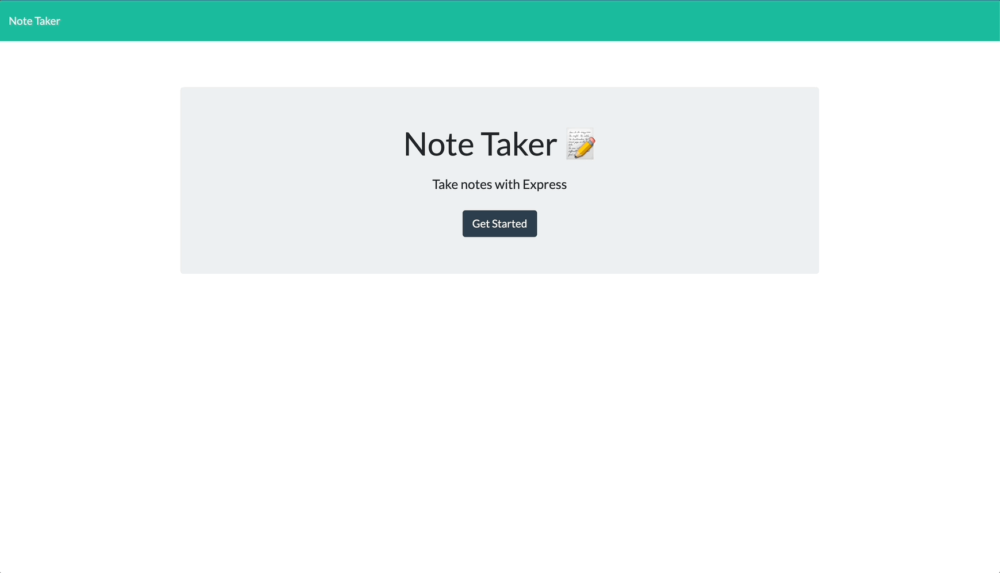

# Note Taker

## Project Summary

The following project entailed creating a note taker that can be used to write, save, and delete notes using an Express.js back end to save and retrieve the note data from a JSON file. The first page you encounter is a landing page which then directs you to the note taking page once you click on the "Get Started" button.

## Table of Contents

- [Languages and Technology Used](#languages-and-technology-used)
- [Project Demonstration](#project-demonstration)
- [Code Snippet](#code-snippet)
- [Author Links](#author-links)

## Languages and Technology Used

- HTML
- CSS
- Javascript
- Express

## Project Demonstration



## Code Snippet

The code below uses a POST route to send the new note information to the JSON file while also generating a random ID for the note in case it is deleted later.

```
app.post("/api/notes", (req, res) => {
  console.log(req.body);

  const newNote = {
    title: req.body.title,
    text: req.body.text,
    id: Math.floor(Math.random() * 1000000),
  };

  notes.push(newNote);
  fs.writeFileSync("db/db.json", JSON.stringify(notes));
  res.json(notes);
});
```

## Author Links

- [GitHub](https://github.com/lilyannekot)
- [Project Website]()
- [LinkedIn](https://www.linkedin.com/in/lilykot/)
